# Cloudconfidence

> How much can you trust the weather forecast when deciding whether to take your umbrella tomorrow?

This is the goal Cloudconfidence :
a data pipeline project aiming to measure and quantify weather forecast errors.<br>

Using open data from the Meteo France API, Cloudconfidence compares forecasts with observed weather to evaluate how reliable they really are.

The project leverages Apache **Airflow** and Apache **Spark** running on a **Kubernetes** cluster, with fine-grained components including **YuniKorn, Celeborn, and Comet DataFusion**.

Observability is handled through **Fluent Bit, Prometheus, and Grafana**, providing visibility across the pipeline.

**Result sample :** 
<figure markdown="span">
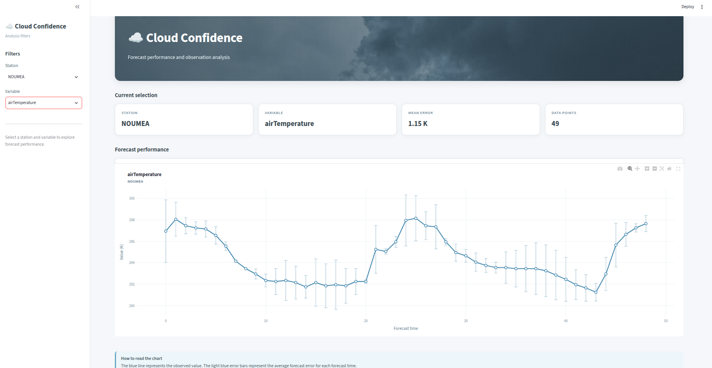
</figure>
<figure align="center">

  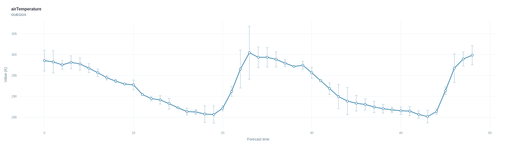
</figure>
<figure align="center">
  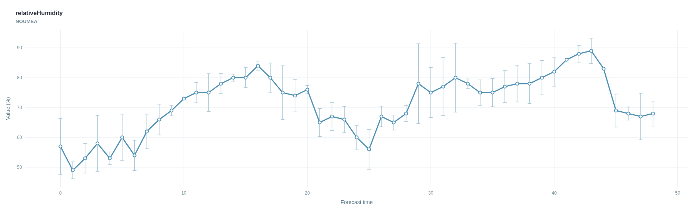
</figure>


## Table of contents

1. [Architecture overview](#architecture-overview)
1. [Meteofrance Open data](#meteofrance-open-data-api)
2. [Library : meteofrance-java-sdk](#-library--meteofrance-java-sdk-)
3. [Extraction : .grib2 hardships](#-data-extraction)
5. [Data mesh and lineage](#-data-mesh-and-lineage)
4. [Library : spark-model](#-library--spark-model)
6. [Yunikorn : scheduling kubernetes resources](#-yunikorn--scheduling-kubernetes-resources)
7. [Spark tuning : comet datafusion & celeborn](#-spark-tuning-comet-datafusion--celeborn)
8. [Fluent-bit : shipping logs to s3](#-fluent-bit-shipping-logs-to-s3)
9. [Prometheus & Grafana : monitoring jobs & pods ](#-prometheusgrafana)
10. [Cloud storage : organizing sotrage & artifacts](#-cloud-storage-storage--artifacts-overview)

## Architecture Overview  

As a simple view what the system basicall is expected to do at regular interval : 
- extract raw data 
- transform it 
- save it on disk

<figure>
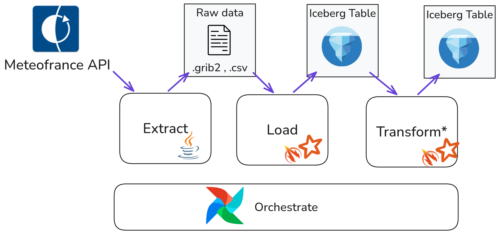
<figcaption align="center">Basic process flow </figcaption>
</figure>

In order to achieve this , the following is needed :
- a spark cluster
- a "landing zone" for raw data
- data warehouse for iceberg table
- a catalog to manage the iceberg tables
- an orchestrator to call process

Which also implies : 
- resource consumption monitoring
- log shipping
- sync with github repo for dags

<figure>
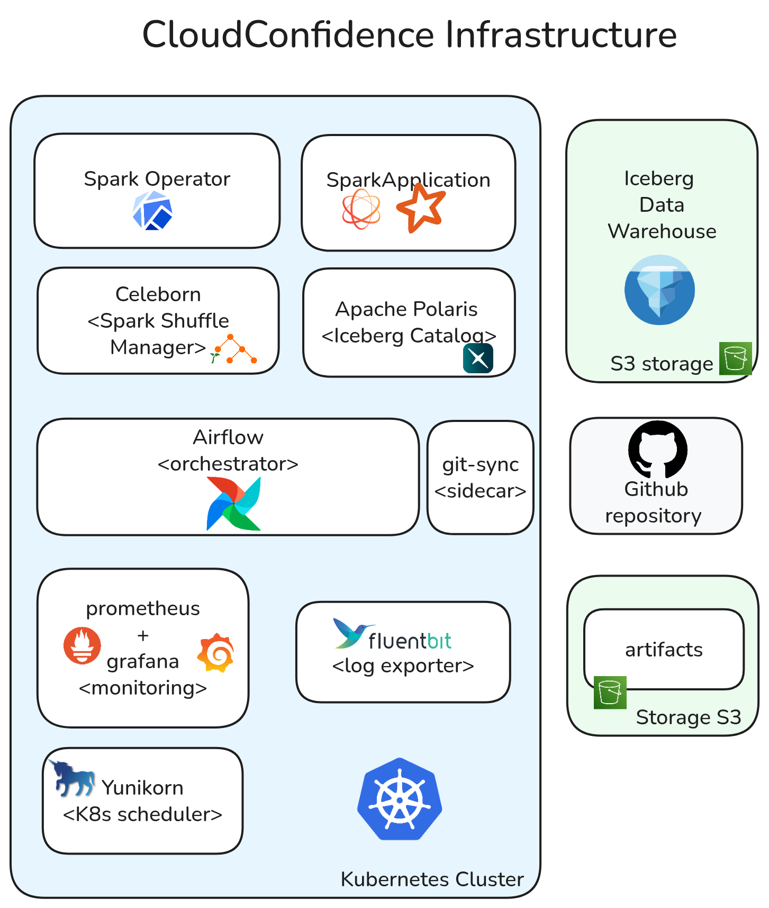
<figcaption align="center">Resources used</figcaption>
</figure>

## MeteoFrance Open Data API

MeteoFrance provides open access to two key datasets:

   **Feature**          | **Description**                                      | **Details**                                                                 |
 |----------------------|------------------------------------------------------|-----------------------------------------------------------------------------|
 | **Observation Records** | Historical and real-time weather observations.       | Direct access to raw observational data.                                   |
 | **Forecast Package**   | Aggregated GRIB2 files for weather forecasts.       | Supports models: `Previnum`, `Arome`, `Arpege`, `Arome-OM`, and `Wave`.     |

### Forecast vs. Observation
The core objective is to **measure forecast accuracy over time**:
- A forecast (e.g., from `ARPEGE` or `AROME-PE`) is generated at a fixed time (e.g., 12:00 AM).
- For each subsequent time step (`t+1`, `t+2`, etc.), the forecast is **compared to real observations** to quantify model reliability.

🔗 [ Meteofrance api portal](https://portail-api.meteofrance.fr/web/fr/)

----
## 📚 Library : meteofrance-java-sdk 

While the **semantic goal**—computing forecast errors—is agnostic to data sources, the **practical implementation** requires:
- **API Request Handling**: Managing inputs/outputs and authentication.
- **Interface Design**: A reusable, maintainable abstraction for interacting with MétéoFrance’s data.
- **Capitalization**: In a corporate context, a library ensures **reusability** across projects, avoiding redundant development and enabling shared maintenance.

Hence a custom side project library was developed.

🔗 [GitHub: `markov-ngz/meteofrance-java-sdk`](https://github.com/markov-ngz/meteofrance-java-sdk)

---

## ⛏️ Data Extraction

The pipeline processes two primary data sources:
- AROME Model Outputs — forecasts
- Observation Records — real-time / historical data

#### Observation Data

Observation data is already available in a tabular format and can be extracted directly as CSV.

Observation Data → CSV → Processing Pipeline

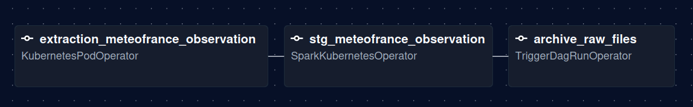
<figcaption align="center"> meteofrance dag </figcaption>

#### Forecast Data — GRIB2

Forecast models such as AROME provide data as GRIB2 files.

GRIB2 is a binary meteorological format designed to store multi-dimensional gridded data (time, latitude, longitude, etc.) together with metadata such as units, descriptions and geographic bounds.

To inspect such files,  a custom tool [grib2-audit](toolsrib2/grib2audit), was developed to inspect, validate and parse GRIB2 files before conversion.

Truncated example output:
```
╔══════════════════════════════════════════════════╗
║           GRIB2 STRUCTURE AUDIT                  ║
╚══════════════════════════════════════════════════╝

▶ VARIABLE : Pressure_reduced_to_MSL_msl
unit        : Pa
description : Pressure reduced to MSL @ Mean sea level
dims        : time(1) x z(1) x y(491) x x(521)
time range  : 2026-07-15T06:00:00Z
bbox        : lat[-26,000 → -13,750] lon[158,500 → 171,500]
java type   : float
fill value  : NaN
data range  : [101413,9219 → 102448,9219]
NaN count   : 0 / 255 811 (0,0%)
```

#### Grib2 challenges 

Unlike CSV, GRIB2 is nested and non-tabular, making it unsuitable for direct ingestion into structured data systems.

So directly processing GRIB2 in Spark to ingest into iceberg introduced unnecessary distribution overhead:
- Broadcasting a large GRIB2 file is inefficient.
- Downloading the file to every worker pod causes redundant storage and I/O.

The chosen approach was therefore to convert GRIB2 to Parquet independently of Spark, and let Spark consume the resulting tabular data.

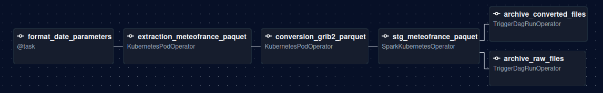
<figcaption align="center"> reusable meteofrance paquet dag </figcaption>

#### Implementation Notes & References
- GRIB2 parsing: NetCDF-Java
- JVM image optimization: Docker images use a multi-stage build with jdeps and jlink.
- GraalVM: A native-image build was evaluated to reduce Java startup time. Reflection and dependency requirements made the approach difficult to maintain, but it remains a potential optimization for future work.

🔗 Related resources:

- [NetCDF-Java](https://github.com/unidata/netcdf-java)
- [jdeps / jlink walkthrough (devoxx france 2026)](https://www.youtube.com/watch?v=854OCcffaDk&pp=ygUSZGV2b3ggamRlcHMgamxpbmcg)
- [Kubernetes & JVM talk (devoxx france 2026)](https://www.youtube.com/watch?v=0ax9EU2Ly2Y )


---

## 🔀 Data Mesh and Lineage

Starting from the raw Meteo-France data, the transformation is structured into three dbt layers: Staging, Intermediate and Mart.

| **Layer** | **Purpose**                                | **Models**                                                                                       |
|-----------|--------------------------------------------|---------------------------------------------------------------------------------------------|
| STG — Staging | Standardization                            | `StgMeteofranceObservation`, `StgMeteofrancePaquet`                                         |
| INT — Intermediate | Transformation                             | `IntStationGridMapping`, `IntStationForecastObservationModel`, `IntUnpivotObservationModel` |
| MART — Gold | Data exposure<br> ( wap style publishing ) | `MartForecastErrorOverTime`                                                                 |


### 🍒 WAP for Mart Layer — Write, Audit, Publish

As the mart layer is directly exposed to consumer, the choice is to use WAP style with Apache Iceberg with the following process : 
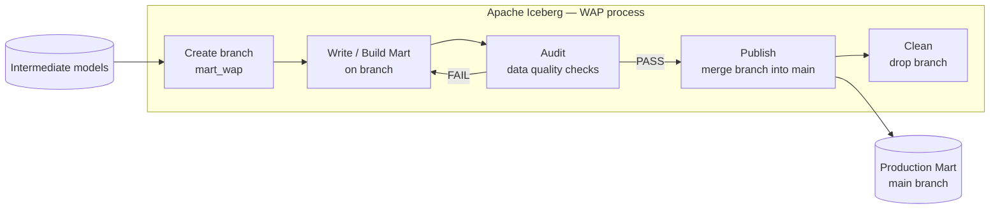

To know more about iceberg , i really recommend this blog : https://iceberglakehouse.com/iceberg/iceberg-wap-pattern/

---
## 📚 Library : Spark model

Now spark is a really sequential way to process transformation, how to keep a semantic sense and introduce this "dbt" way of transforming data ?
Which by the way has all the  other benefits of splitting the process/rules applied , schema and materialization/configuration.

=> developed spark-model library which is light dbt to work with spark but with models 

It also allows to see generate a nice lineage chart of the data  : 

```mermaid
flowchart LR;
    classDef bronzeClass fill:#CD7F32,stroke:#8B4513,stroke-width:2px,rx:10,ry:10,color:#000000;
    classDef silverClass fill:#C0C0C0,stroke:#707070,stroke-width:2px,rx:10,ry:10,color:#000000;
    classDef goldClass fill:#FFD700,stroke:#B8860B,stroke-width:2px,rx:10,ry:10,color:#000000;
    classDef sourceClass fill:#87CEEB,stroke:#4682B4,stroke-width:2px,rx:10,ry:10,color:#000000;
    classDef seedClass fill:#D8E9E6,stroke:#4682B4,stroke-width:2px,rx:10,ry:10,color:#000000;
    classDef edgeClass stroke:#333,stroke-width:2px;
    SourceMeteoFrancePaquet["SourceMeteoFrancePaquet"]:::sourceClass;
    click SourceMeteoFrancePaquet "#" "location: 'input/paquets/'<br> materialized: 'file'";
    SeedStandardizedVariable["SeedStandardizedVariable"]:::seedClass;
    click SeedStandardizedVariable "#" "location: 'input/referentiels/standardized_variable.csv'<br> materialized: 'file'";
    SeedStandardizedUnit["SeedStandardizedUnit"]:::seedClass;
    click SeedStandardizedUnit "#" "location: 'input/referentiels/standardized_unit.csv'<br> materialized: 'file'";
    StgMeteoFrancePaquetModel["StgMeteoFrancePaquetModel"]:::bronzeClass;
    click StgMeteoFrancePaquetModel "#" "location: 'null'<br> materialized: 'ephemeral'";
    SeedMeteoFranceStation["SeedMeteoFranceStation"]:::seedClass;
    click SeedMeteoFranceStation "#" "location: 'input/referentiels/meteofrance_stations.csv'<br> materialized: 'file'";
    IntStationGridMappingModel["IntStationGridMappingModel"]:::silverClass;
    click IntStationGridMappingModel "#" "location: 'null'<br> materialized: 'ephemeral'";
    SourceMeteoFranceObservation["SourceMeteoFranceObservation"]:::sourceClass;
    click SourceMeteoFranceObservation "#" "location: 'input/observations/'<br> materialized: 'file'";
    SeedMeteoFranceObservationVariable["SeedMeteoFranceObservationVariable"]:::seedClass;
    click SeedMeteoFranceObservationVariable "#" "location: 'input/referentiels/meteofrance_observation_variable.csv'<br> materialized: 'file'";
    StgMeteoFranceObservationModel["StgMeteoFranceObservationModel"]:::bronzeClass;
    click StgMeteoFranceObservationModel "#" "location: 'null'<br> materialized: 'ephemeral'";
    IntUnpivotObservationModel["IntUnpivotObservationModel"]:::silverClass;
    click IntUnpivotObservationModel "#" "location: 'null'<br> materialized: 'ephemeral'";
    IntStationForecastObservationModel["IntStationForecastObservationModel"]:::silverClass;
    click IntStationForecastObservationModel "#" "location: 'null'<br> materialized: 'ephemeral'";
    IntAggForecastErrorOverTimeModel["IntAggForecastErrorOverTimeModel"]:::silverClass;
    click IntAggForecastErrorOverTimeModel "#" "location: 'null'<br> materialized: 'ephemeral'";
    MartForecastErrorOverTimeModel["MartForecastErrorOverTimeModel"]:::goldClass;
    click MartForecastErrorOverTimeModel "#" "location: 'null'<br> materialized: 'ephemeral'";
    IntAggForecastErrorOverTimeModel --> MartForecastErrorOverTimeModel;
    IntStationForecastObservationModel --> IntAggForecastErrorOverTimeModel;
    StgMeteoFrancePaquetModel --> IntStationForecastObservationModel;
    SourceMeteoFrancePaquet --> StgMeteoFrancePaquetModel;
    SeedStandardizedVariable --> StgMeteoFrancePaquetModel;
    SeedStandardizedUnit --> StgMeteoFrancePaquetModel;
    IntStationGridMappingModel --> IntStationForecastObservationModel;
    SeedMeteoFranceStation --> IntStationGridMappingModel;
    StgMeteoFrancePaquetModel --> IntStationGridMappingModel;
    IntUnpivotObservationModel --> IntStationForecastObservationModel;
    StgMeteoFranceObservationModel --> IntUnpivotObservationModel;
    SourceMeteoFranceObservation --> StgMeteoFranceObservationModel;
    SeedMeteoFranceObservationVariable --> StgMeteoFranceObservationModel;
    SeedMeteoFranceStation --> StgMeteoFranceObservationModel;
    SeedStandardizedVariable --> StgMeteoFranceObservationModel;
    SeedMeteoFranceObservationVariable --> IntUnpivotObservationModel;
    SeedStandardizedVariable --> IntUnpivotObservationModel;
    SeedStandardizedUnit --> IntUnpivotObservationModel;

```

library repository: 
🔗 [spark-model](https://github.com/markov-ngz/spark-model)

--- 

## 🐎 Yunikorn : scheduling kubernetes resources

Now let's dive a bit deeper into the technical side with the choice to not use k8s default scheduler but to use yunikorn.

Yunikorn offers benefits  for : 
- cluster multi tenancy : user based resource usage tracking allows to limit resources for a given queue.
- gang scheduling : allows sparkapplication to reserve a set of resources and be run when ready

Even though here no configuration was set as it is a local cluster, a more fine grained cluster with a set of resources could be set.

<figure markdown="span">
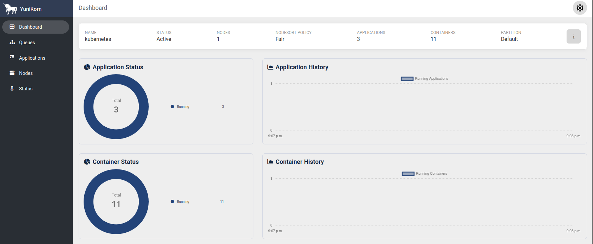
<figcaption align="center"> yunikorn dashboard</figcaption>
</figure>

🔗 References : 
- [Yunikorn architecture documentation](https://yunikorn.apache.org/docs/next/design/architecture)
- [Video : Apache YuniKorn A Kubernetes Scheduler Plugin for Batch Work... Wilfred Spiegelenburg & Craig Condit](https://www.youtube.com/watch?v=cQD_jwA4fqo&pp=ygUTeXVuaWtvcm4ga3ViZXJuZXRlcw%3D%3D)

---

## 💫 Spark Tuning: Comet DataFusion & Celeborn

Here, Spark is tuned in two main areas:

- **Shuffle management**
- **Query execution**

### Query Execution Engine: Comet DataFusion

Why choose Comet DataFusion?

It allows Parquet data to be decoded using native code directly into the Arrow format, avoiding the need to convert Spark rows and columns into Arrow ([reference](<https://youtu.be/o59s0d3HE1k?t=1114>)).

As a result, Parquet reads are significantly more efficient, which is particularly beneficial for this project since the data is stored as Parquet files.

There was no clear choice between Comet and Gluten. However, a benchmark should definitely be performed before using either solution in production. See the [comparison documentation](<https://datafusion.apache.org/comet/about/gluten_comparison.html>).

> **Note:** As of August 2026, Comet + Celeborn was still in preview, so it was built from source (snapshot 1.1.0).

🔗 References :
- [Accelerating Spark with Apache Datafusion Comet - Andy Grove Carnegie Mellon University](https://www.youtube.com/watch?v=o59s0d3HE1k&pp=ygUXYXBhY2hlIGNvbWV0IGRhdGFmdXNpb24%3D)
- [Apache Datafusion - Matt Butrovich](https://www.youtube.com/watch?v=P_GLl14d9A4&pp=ygUdYXBhY2hlIHNwYXJrIGRhdGFmdXNpb24gY29tZXQ%3D)
- [building comet datafusion from source ](https://datafusion.apache.org/comet/user-guide/latest/source.html)

### Shuffle Manager: Celeborn

Shuffling Spark data is a heavy operation involving both **disk I/O and network I/O**.

Using an external shuffle manager such as Celeborn moves this workload away from the compute nodes, reducing the amount of local disk space required to store shuffle data.

Reference: https://celeborn.apache.org/docs/latest/developers/overview/

---

## 🐦 Fluent-bit: Shipping Logs to S3

Logs are handled with **Fluent-bit** (OpenTelemetry was also considered). Logs from the namespace are shipped from outside the cluster to an S3 bucket.

#### shipping log pipeline:
- **Input**: Logs are collected from **Pods** (Kubernetes or other sources).
- **Filter**: Logs are filtered by the **working namespace** (e.g., only logs from a specific namespace are processed).
- **Output**: Filtered logs are shipped to an **S3 bucket** (outside the cluster).
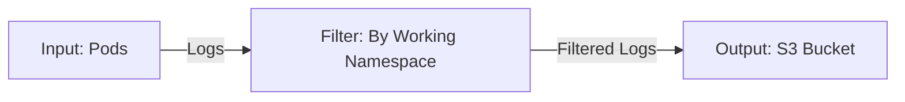


#### S3 Structure Issue
On S3, the following structure was initially defined:
```sh
kubernetes/
  namespace/
    pods/
```
However, this was a poor choice because:
- Pod names are **unique** and ephemeral.
- There is no long-running "business applicative" process, leading to **many new pods being created daily**.

Instead of organizing logs by **pod names**, it seems wiser to use :
- **Custom labels** (e.g., `app`, `service`, or `component`).
- **Default to the resource** (e.g., `deployment`, `statefulset`, or `daemonset`).

---

## 👁️ Prometheus/Grafana

The basic duo to monitor application configured with the Helm chart. It was used to track **Spark application usage** ( memory and gc usage ).

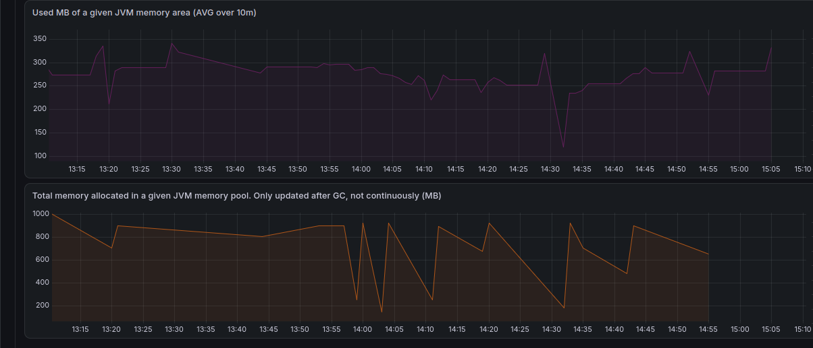


---

### 🪣 Cloud Storage: Storage & Artifacts Overview
Using **Terraform**, 4 buckets were created:

- **`datawarehouse`**: Reserved for the **Iceberg catalog**.
- **`landing-zone`**: Stores **extracted data**.
- **`artifacts`**: Contains **logs and build artifacts**.
- **`data-quality`**: Used in an early version to store **low-quality records**.

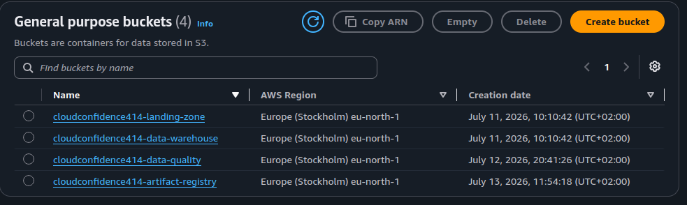

---

## Cite & Share 🌞

Thanks for reading! Although many technologies were explored, one of the goals was to test and validate a few key tools to build a **robust cluster**, similar to the one defined by **Airbnb** (see: [Airbnb’s Apache Spark Setup](https://www.youtube.com/watch?v=ejJ6A0sIdbw&pp=ygUUYWlyYm5iIGFwYWNoZSBzcGFybCA%3D)).

---